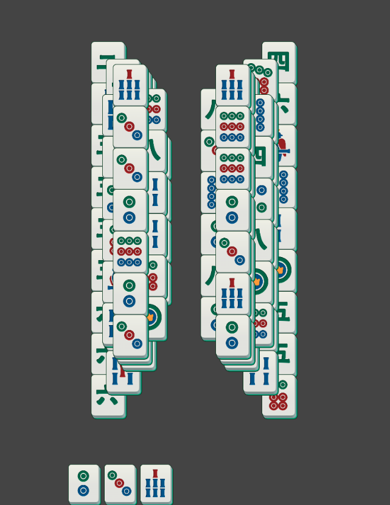

> From: Tokiki Tile3 分析参数V2

#### 行为分类
##### 消除行为
- 简单： 当前盘面下，某花色的可选棋子数量和序列内该花色的棋子数量之和 >= 3, 则这几个可选棋子视为直接可消除的操作
> 这个Ok，都是可选棋子的组成的行为

- 困难：当前盘面下，有同花色的几个棋子
> 可选 + 可见 棋子组成的消除
  - 其中有至少一个棋子为可选棋子
  - 剩余棋子均为可见棋子，且他们的锁定棋子仅有组（当前消除组）内其他的棋子， 及不会引入其他的成本
  - 记录可见棋子的数量

一种情况
卡槽  a a 
盘面 b -> a, 且盘面无可选棋子a
这个 b,a 是什么
> 解答：这里的 没有 b,a, 只有 b 这一个翻牌行为
> 计算展开棋子的价值的目的：对于一个选择的牌，他本身只有成本，正在有价值的是这个棋子消除后可以带来什么

##### 翻牌行为
没有消除行为的花色，玩家将一张这样的牌放入 Sequence，则视为翻牌行为

#### 翻牌价值计算
无论是消除行为还是翻牌行为，都会形成新的牌面的展开（除非其在最下层), 需要计算展开棋子的价值，分为以下几类
> Question: 这个 **计算展开棋子的价值** 这是只指选择的这个棋子，还是去除这个棋子展开后的那几个棋子？？
> 新的理解： 下面有暗牌，如果是选择的这个棋子，就绝不可能是为暗牌，所以这里是计算  除这个棋子展开后的那几个棋子 的价值

- 可形成消除的棋子
  - 分数： 3
  - 可见棋子
  - 其在盘面上已经具有相同花色的可选棋子
  - 行为展开的数量和其可选的棋子数量之和 >= 3
> 理解： 这个棋子在消除行为中，都是可形成消除的棋子
- 暗牌
  - 分数：2
  - 不可见棋子

- 不可形成消除的棋子
  - 分数：1
  - 可见棋子
  - 以上都不是

    
#### 行为价值计算
- 查看当前行为涉及到的所有棋子压着的所有棋子的集合，对其中的**每个棋子**进行以下的计算
  - 查看导致这个棋子锁定的棋子结合数量（包含行为内的棋子) 向上寻找
    - 棋子的集合数量 LockingMahjongsCount
    - 棋子集合中包含行为内棋子数量 MovingLockingMahjongsCount
  - 查看其翻牌价值。MahjongValue 向下
  - 计算分数
    - VisibleMahjongScore = MahjongValue * LockingMahjongsCount / MovingLockingMahjongsCount
  - 这里需要注意下，可能会有牌压着一个可见牌，这个可见牌又是唯一导致另一个同花色可见牌锁定的棋子，若这个花色在当前盘面下有一个可选牌，也是一个值得注意的情况
  > 三个同色牌连压 ？？
  > 解答：这个没有问题，这三个牌在同一个消除行为中，没有要消除而引入额外的成本
- 将以上所有分数下相加，则为行为内一张牌的分数，将行为内的所有牌的这个分数相加，即为这个行为的分数
- 依旧行为分数通过SoftMax转化为权重，依据权重随机选择

