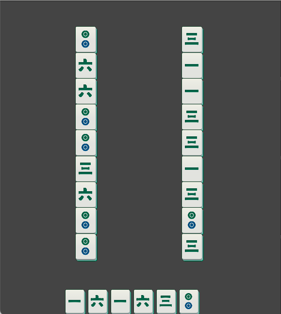

> 需要根据剩余的卡槽容量来过滤一些放不下的消除卡组
> 例如 3筒 + 3筒的消除卡组就不行，卡槽放不下

#### 行为分类步骤
卡槽花色与分类
slotMap: {color: index[]}
可选花色与分类
selectableMap {color: index[]}

简单消除行为筛选：
slotMap[color] + selectableMap[color] >= 3

1. slotMap[color] + selectableMap[color] >= 3
分类： C(selectableMap[color], selectableMap[color] - slotMap[color])
2. selectableMap[color] > 3
C(selectableMap[color], 3)

困难消除行为: 棋子组成： 可选 + 可见
1. 对每个可选棋子过滤 在卡槽中差一个就可以满的
2. 剩余的可选棋子，过滤展开棋子后没有同颜色的

（自己 + 自己展开后的棋子）2 
选择其他的：
1. 从加上卡槽满足配对
2. 从其他可选同色棋子中选择 C(remainCount, 3 - 2)

3. 过滤卡槽配对后满足情况的，继续选择展开后的同色棋子展开
有，则一起构成一个消除组

> 有消除行为从消除行为中选取，无消除行为从翻盘行为中选取

   
1. 翻牌价值计算

给定一个牌，