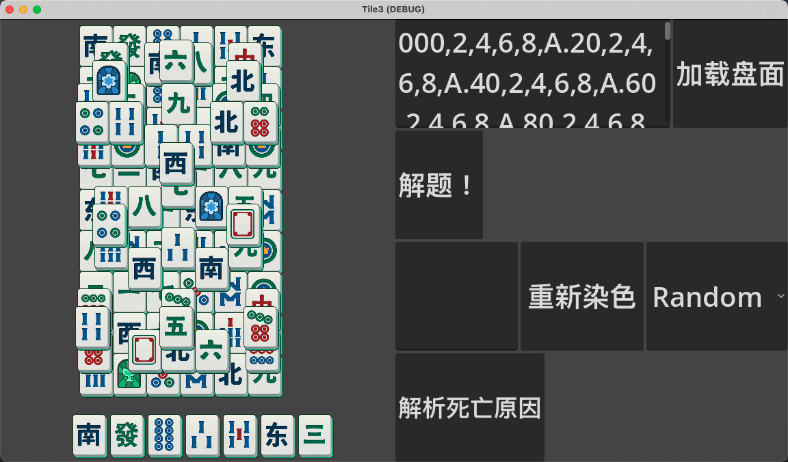

### 麻将的布局问题


1. 关卡容器与关卡关卡本身的适配
   - Fit-Width
   - Fit-Height

2. 麻将本身的单元格为长方形
3. 对于关卡本身
   - z层有偏移的累积
   - 当层单列也有美术设计中一定偏移量


#### 0204 周三的理解
##### 已知信息
关卡容器的大小
 - ContainerWidth
 - ContainerHeight
关卡内容的逻辑信息
 - 长  ContentY
 - 宽  ContentX
 - 高  ContentZ

统一单元大小 unit

关卡Cell高度的换算： CellYRatio = 1.1 unit
关卡Cell宽度的换算： CellXRatio = 1.05 unit

关卡内容在统一单元下的大小
ContextWidthAtUnit
ContextHeightAtUnit

缩放目标： 关卡内容去适配关卡容器的大小

逻辑高宽比  比值会去除单位的影响
- containerHWRatio = ContainerHeight / ContainerWidth
- contentHWRatio = ContextHeightAtUnit / ContextWidthAtUnit

```C#
if (containerHWRatio > contentHWRatio){ // 关卡容器更高，宽度一样
    //  Fit-Width， 此时可认为他们的宽度相同
    //  ContextWidthAtUnit * Unit = ContainerWidth
    //  可以得出每个单元格的最终大小
    var unit = ContainerWidth / ContextWidthAtUnit;
    var containerWidthAtUnit = ContextWidthAtUnit;
}
else
{
    // Fit-Height, 整理可认为他们是等高的
    // ContextHeightAtUnit * Unit = ContainerHeight
    var unit =  ContainerHeight / ContextHeightAtUnit;
    var containerHeightAtUnit = ContextHeightAtUnit;
}
```

完善上述后：
可用 Unit作为单位为统一的布局，这个作为问题1和问题2的解答


问题3的处理

如何根据根据：
- 长  ContentY
- 宽  ContentX
- 高  ContentZ
以及考虑到
   - z层有偏移的累积
   - 当层单列也有美术设计中一定偏移量
得到最终最终的 关卡内容在统一单元下的大小
- ContextWidthAtUnit
- ContextHeightAtUnit

```C#
const CellXFillOffsetfactor;
const CellYFillOffsetfactor;
const XOffestAtZRatio;
const YOffsetAtZRatio;

ContextWidthAtUnit = ContentX * CellXRatio + (CellXFillOffsetfactor - 1) * CellXRatio + (Z - 1) * XOffestAtZRatio;
ContextHeightAtUnit = ContentY * CellYRatio + (CellYFillOffsetfactor - 1) * CellYRatio + (Z - 1) * YOffsetAtZRatio;
```

关卡第一个Cell的位置： 关卡居中显示，锚点在左上角， Z轴偏移是往左上角移动，所以这是顶层的第一个格子
- Fit-Width
  - CellGlobalOffset = (0, (containerHeightAtUnit - ContextHeightAtUnit) / 2)
- Fit-Height
  - CellGlobalOffset = ((containerWidthAtUnit - ContextWidthAtUnit) / 2, 0)

获取最底层的第一个格子
CellGlobalOffset += （z - 1) * (XOffestAtZRatio, YOffsetAtZRatio) * unit

